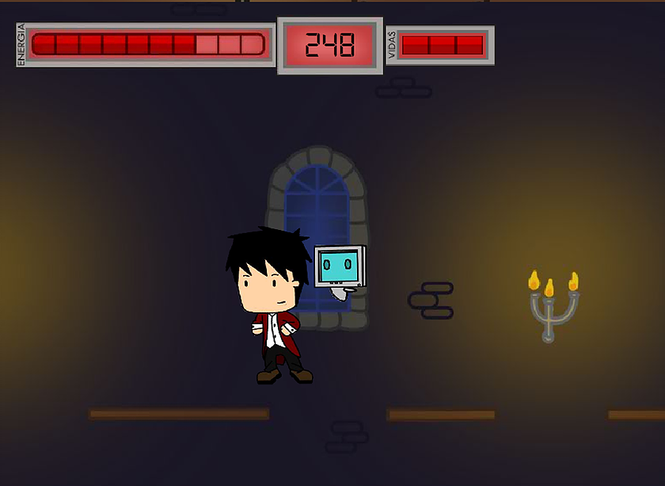

# Faculdade

### L.I.P.E. TESTE 6

<html>
    <link rel="stylesheet" href="css/blueimp-gallery.css"> <!-- Stylesheet -->
    <body>
        

            

            <h3 class="title"></h3>
            <a class="prev">‹</a>
            <a class="next">›</a>
            
        

        
        
<!-- Gallery images -->
            
            
             <!-- Gallery images -->
        

        
        
         <!-- Gallery script -->
    </body>
</html>
