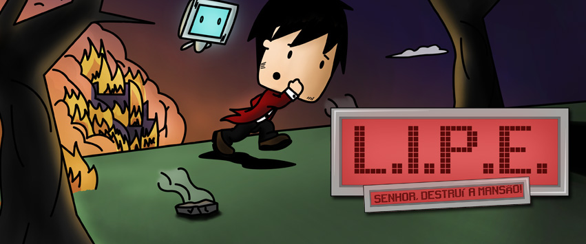
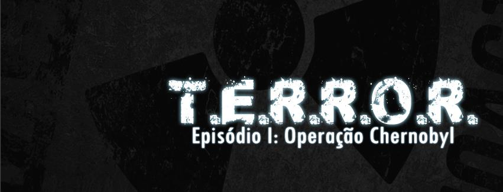

# Faculdade

### L.I.P.E. TESTE 36

<html>
    <head>
        <link rel="stylesheet" href="css/blueimp-gallery.min.css">
    </head>
    <body>
        
        

            
        
   
        

            

            <h3 class="title"></h3>
            <a class="prev">‹</a>
            <a class="next">›</a>
            
            <ol class="indicator"></ol>
        
        
        

Trabalho final de 3º semestre da faculdade de Design de Games, com foco em desenvolvimento de jogos 2D com o uso do Flash CS 5.5.

Clique [AQUI](http://www.newgrounds.com/dump/item/5e958707d6b1bda6a80e1e71889bddcb) para jogar.

Curta a pagina no facebook, clicando [AQUI](https://www.facebook.com/gamelipe).

* * *

### T.E.R.R.O.R.

        

             
        
   
        

            

            <h3 class="title"></h3>
            <a class="prev">‹</a>
            <a class="next">›</a>
            
            <ol class="indicator"></ol>
        
        
        

Primeiro projeto utilizando a engine UNITY e modelagem 3D. O intuito era fazer com que o jogador explore o local e descubra o caminho.

Clique [AQUI](http://www.mediafire.com/download/9k2yy71wp4svvu0/T.E.R.R.O.R_v1.1.rar) para baixar o jogo.

Um canal no youtube fez um video do jogo, clique [AQUI](http://www.youtube.com/watch?v=2QmnALqEPco&feature=g-all) para assistir.

Curta a pagina do facebook clicando [AQUI](https://www.facebook.com/terrorthegame).

    </body>   
</html>
