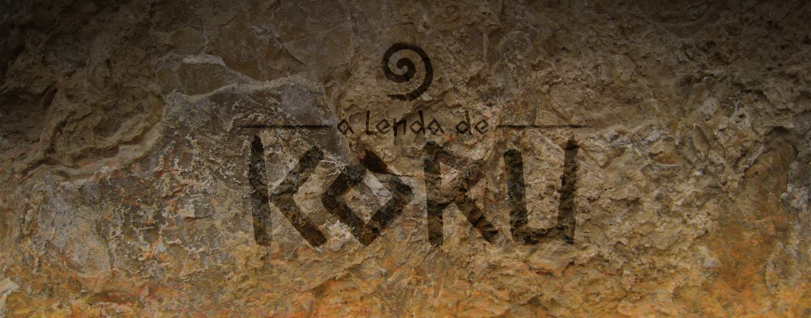

# Faculdade

### MEMORYA

<html>
    <head>
        <link rel="stylesheet" href="css/blueimp-gallery.min.css">
    </head>
    <body>
        
        

             
        
   
        

            

            <h3 class="title"></h3>
            <a class="prev">‹</a>
            <a class="next">›</a>
            
            <ol class="indicator"></ol>
        
        
        
    </body>   
</html>
Jogo com o intuito de utilizar animações 3D e inteligencia artificial. Baseado no filme Eternal Sunshine of the Spotless Mind, o jogador deverá recolher as memorias de Clem (Clementine no filme) para não esquecer de Joel, seu namorado.

Link para download, clique [AQUI](http://www.mediafire.com/download/w6vdkwdvwpdef3c/Memorya.rar).

Trailer do jogo, cliquei [AQUI](https://www.youtube.com/watch?v=nOR7zG8LKfY).

Curta a pagina do facebook clicando [AQUI](https://www.facebook.com/memoryagame).

* * *

### A Lenda de Koru

<html>
    <head>
        <link rel="stylesheet" href="css/blueimp-gallery.min.css">
    </head>
    <body>
        
        

                
        
   
        

            

            <h3 class="title"></h3>
            <a class="prev">‹</a>
            <a class="next">›</a>
            
            <ol class="indicator"></ol>
        
        
        
    </body>   
</html>
Jogo criado como Trabalho de Conclusão de Curso, desenvolvido na Unity 3D. O jogador estará na pele de Marohirohi, correndo contra o tempo para encontrar ingrediantes e salvar seu irmão de uma maldição enviada pelos deuses.

Link para download, clique [AQUI](http://www.mediafire.com/download/u6q333jyj1wjmiu/A+Lenda+de+Koru.rar), ou [AQUI](https://mega.co.nz/#!5h0zXYhY!dQpxKkqwGBOF4kJIVhLhYM1mIeArv6RKwfA4k21cazk)

Trailer do jogo, cliquei [AQUI](https://www.youtube.com/watch?v=A_Z55b4Bvp4).

Curta a pagina do facebook clicando [AQUI](https://www.facebook.com/lendadekoru).

[Voltar](./)
